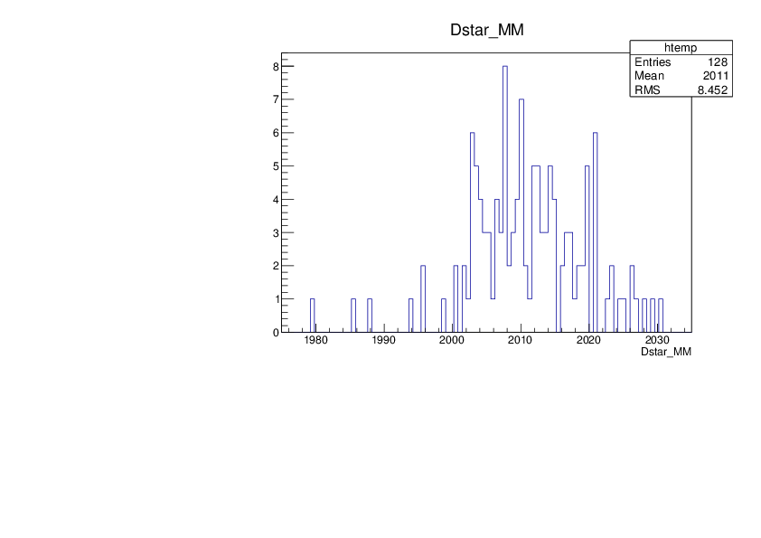
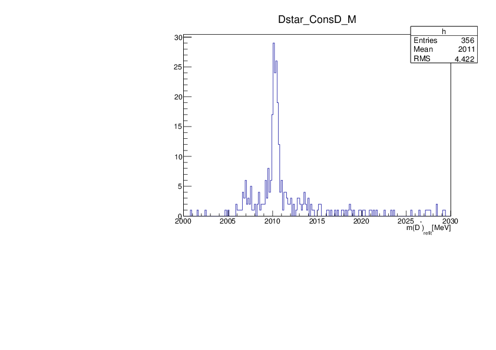
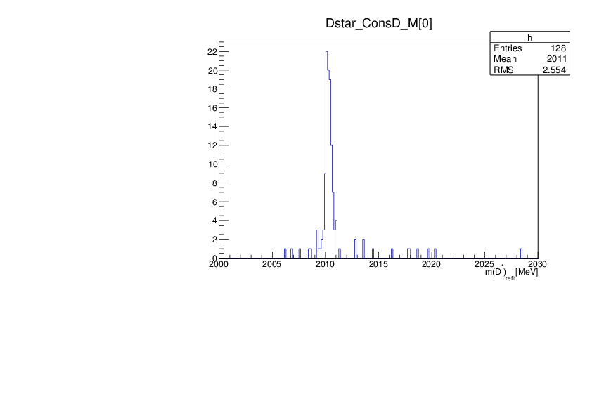
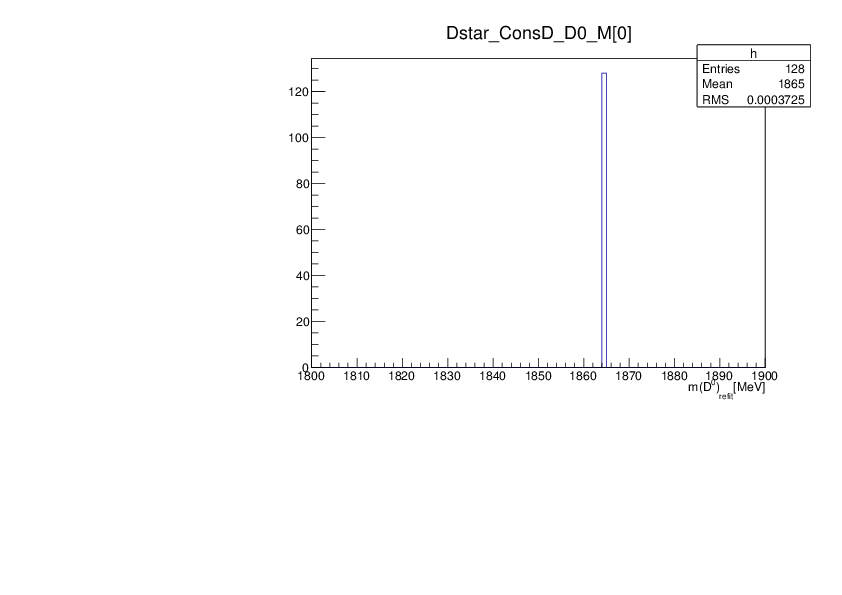

> ## Learning Objectives {.objectives}
>
> * Add a kinematic fitter to a branch in the decay tree
> * Apply a mass constraint
> * Inspect the refitted decay tree

Once you have made a hypothesis on the chain of decays that have lead to your final state, you then can incorporate the additional knowledge that comes with this hypothesis to get a new best estimate for the particle parameters - in particular their momenta. The additional knowledge is represented as constaints, which your decay tree has to fulfill.

For example for the decay
```python
'[D*(2010)+ -> (D0 -> K- pi+) pi+]CC'
``` 
you make the assumption that the (K- pi+) combine to form a D0 with a specific invariant mass. This results in a so called *mass-constraint*. In addition the kaon and the pion are supposed to originate from exactly the same point in space. If you are looking for prompt D* you can require them to come from the primary vertex. Boundary conditions like those are called *vertex-constraints*. 

Applying such kinematic constraints leads to new best estimates for the track parameters of the final state particles. The process of calculating those is called a *kinematic refit* and the `TupleToolDecayTreeFitter` is the algorithm that performs this task for us. 

> ## The physics and mathematics behind DecayTreeFitter {.callout}
> For details of the method see the paper on [Decay chain fitting with a Kalman filter](http://arxiv.org/abs/physics/0503191).

So how do we use a `TupleToolDecayTreeFitter` to our DaVinci script? Let's create a branch to add the tool to. Let's just name it `'Dstar'`:
```python
from Configurables import TupleToolDecayTreeFitter,TupleToolDecay
dtt.addBranches({
    'Dstar': '[D*(2010)+ -> (D0 -> K- pi+) pi+]CC',
}) 
```
To this branch we can now apply the `TupleToolDecayTreeFitter`. 
```python
dtt.Dstar.addTupleTool(TupleToolDecayTreeFitter('ConsD'))
```
Now we can proceed with the configuration of the fitter. We are going to constrain the decay tree to the primary vertex of origin. We want all the output available, so we set the `verbose` option. Finally we want to apply the mass constraint on the D0:
```python
dtt.Dstar.ConsD.constrainToOriginVertex = True
dtt.Dstar.ConsD.Verbose = True
dtt.Dstar.ConsD.daughtersToConstrain = ['D0']
```
Note that you can constrain more than one intermediate state at once if that fits your decay. 

> ## Which constraints to apply {.callout}
> It is important to be aware what assumptions you bake into your ntuple. For example, after you require the vertex constraint you can't use the `IP_CHI2_OWNPV` anymore, since the particle you are looking at is *forced* to point to the PV. Which constraints make most sense for you depends on the questions you want to ask in your analysis. 


Once you have produced your ntuple you can have a look at the refitted variables.
```shell
root -l DVntuple.root
TupleDstToD0pi_D0ToKpi->cd()
DecayTree->StartViewer()
```
Plotting the raw mass of the D* (without the fit) `Dstar_MM` you should see a broad signal around 2 GeV:



Now let us look at the refitted mass of the D*, with the D0 constrained to its nominal mass. It is stored in the variable `Dstar_ConsD_M`. If you plot this you will note that some values are unphysical. So, let's restrict the range we look at to something that makes sense. 

On the root prompt use the `arrow-up` key to get the last draw command and modify it to pipe the output into a histogram:  
```shell
tv__tree->Draw("Dstar_ConsD_M>>h(200,2000,2030)","","");
```



Note that this plot has 356 entries, although we only have 128 candidates in the raw mass spectrum. The reason for this is, that we typically have several primary vertices per event. When you use the vertex contraint, the fitter is run for each of the possible vertex hypothesis available in the event. So all the `Dstar_ConsD-xxx` variables are in fact arrays, where the first value corresponds to the *best PV* hypothesis. We can plot only those by doing
```shell
tv__tree->Draw("Dstar_ConsD_M[0]>>h(200,2000,2030)","","");
```
and we get the final kinematically refitted Dstar mass:



Finally, let's check how the D0 mass constraint has played out.

```shell
tv__tree->Draw("Dstar_ConsD_D0_M[0]>>h(100,1800,1900)","","", 128, 0);
```



As expected, the D0 candidates are forced onto their PDG mass value.

The solution to this exercise `ntuple_DTF1.py`, is [available 
here](./code/22-decay-tree-fitter/ntuple_DTF1.py).

> ## Explore {.challenge}
> * Look at the `status` variable to check if the fits converged.
> * Look at the chi2 distribution of the fit 