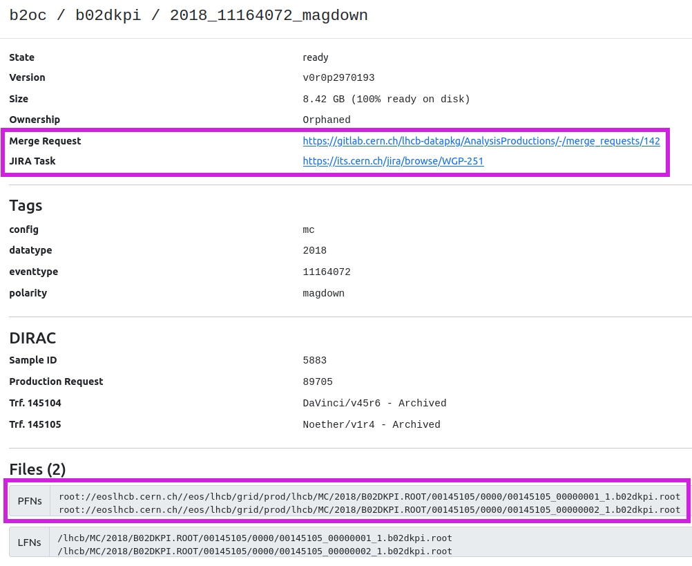

# Analysis Productions



* Understand the reasons to use Analysis Productions
* Look at some pre-existing productions
* Create your own production



Running DaVinci locally can be great for testing an options file, but is rarely appropriate for creating the full set of ROOT ntuples needed for an analysis. Historically, people would submit their jobs to the grid: one can send off a large number of DaVinci jobs to be handled by batch computing resources (in certain cases, this is still useful - see the [next lesson](davinci-grid) for how to do this). However, this still has some drawbacks, in particular:

* Large datasets (especially in run 3) would require a long period of monitoring your grid jobs.
* Computing resources can be wasted if multiple analyses are independently producing similar ntuples.
* Ntuples can be lost, or removed when analysts leave, which can be an issue for [analysis preservation](https://lhcb-dpa.web.cern.ch/lhcb-dpa/wp6/index.html).

It is the goal of [Analysis Productions](https://gitlab.cern.ch/lhcb-datapkg/AnalysisProductions/) to centralise and automate much of the process of making ntuples, and to keep a record of how datasets were produced. In Run 3, this is the preferred way to create ntuples for your analysis.

## Monitoring productions

Before we get into the how-to, let's first take a look at the end result of a real production. Open the [Analysis Productions webpage](https://lhcb-analysis-productions.web.cern.ch/), and navigate to `Productions`. You should see a new menu appear, showing a list of productions. Using the search bar on the right you can search for any production of interest, try `b02dkpi` for example. This should return one result and clicking on it should show you a table of jobs belonging to the production.

Each row in the table corresponds to a job belonging to this production, and displays:

* Its status (e.g. READY, ACTIVE)
* Its name (e.g. 2018_15164022_magup)
* Some of its tags (e.g. MC/DATA, Run1/Run2)
* When it needs a housekeeping check, when it was created and when it was last updated
* The version of the Analysis Productions repository it corresponds to

To view more information about any one of these jobs, you can click on it to view a job summary page. The image below shows one such page, with a couple of particularly useful elements highlighted in magenta.



The top section shows a summary of important information, such as the state of the job, its production version, the total storage required for the output files and the merge request used to submit the production. To view the input scripts used to set up the production click the link to the merge request. The next section lists the DIRAC production information for the job. Finally, is the Production Output section which lists the output files for the job. One can use either the PFNs or LFNs to access the output, the PFNs should be visible to all systems with access to the CVMFS.

Let's try accessing one of these files right now by doing:
```bash
root -l root://eoslhcb.cern.ch//eos/lhcb/grid/prod/lhcb/LHCb/Collision12/B02DKPI.ROOT/00121782/0000/00121782_00000004_1.b02dkpi.root
```

You can now explore this file by doing `TBrowser b` inside of ROOT (or with another method of your choice).


## Creating your own production

For practice, we will now go through the steps of creating a simple production. For details about more advanced usage, see the [Analysis Productions documentation](https://lhcb-ap.docs.cern.ch/index.html).

Start by creating a folder to work in, and into it clone the [Analysis Productions repository](https://gitlab.cern.ch/lhcb-datapkg/AnalysisProductions).

```bash
git clone ssh://git@gitlab.cern.ch:7999/lhcb-datapkg/AnalysisProductions.git
cd AnalysisProductions
```

Before making any edits, you should create a branch for your changes, and switch to it:

```bash
git checkout -b ${USER}/starterkit-practice
```

Now we need to create a folder to store all the things we're going to add for our new production. For this practice production, we'll continue with the `$ D^{0} \to K^{-}K^{+} $` decays used in the previous few lessons, so we should name the folder appropriately:

```bash
mkdir starterkit
```

Let's enter that new directory (`cd starterkit`), and start adding the files we'll need. First is the DaVinci options file. If you have the options file you created during the previous lessons in a working condition, copy it here, and open it with your text editor of choice. 

If you don't have your options file from earlier available, or are having trouble, you can [use this options file](code/analysis-productions/dv_basic.py).

The next file needed is a `.yaml` file, which will be used to configure the jobs. Create a new file named `info.yaml`, and add the following to it:

```yaml
defaults:
  application: DaVinci/v64r12
  output: DATA.ROOT
  options:
    entrypoint: starterkit.dv_basic:main
    extra_options:
      input_type: ROOT 
      input_raw_format: 0.5
      simulation: false
      input_process: "TurboPass"
      geometry_version: run3/2024.Q1.2-v00.00
      conditions_version: master
      lumi: true
      data_type: "Upgrade"
      input_stream: b2cc
  inform:
    - aidan.richard.wiederhold@cern.ch
  wg: DPA

Bu2Jpsimumu_24c4_MagDown:
  input:
    bk_query: "/LHCb/Collision24/Beam6800GeV-VeloClosed-MagDown/Real Data/Sprucing24c4/94000000/B2CC.DST"
```

Here, the unindented lines are the names of jobs (although `defaults` has a special function), and the indented lines are the options we're applying to those jobs. Using this file will create one job called `Bu2Jpsimumu_24c4_MagDown`, that will read in data from the provided bookkeeping path. All the options applied under `defaults` are automatically applied to all other jobs - very useful for avoiding repetition. The options we're using here are copied from the Run 3 DaVinci lesson:

* **application**: the version of DaVinci to use. Here we choose v64r12, see [here](http://lhcbdoc.web.cern.ch/lhcbdoc/davinci/) to check what versions are available.
* **wg**: the working group this production is a part of. Since this is a `$B^+ \to J/\psi 'mu^+ \mu^-$` decay, we'll set this to `B2CC`.
* **inform**: optionally, you can enter your email address to receive updates on the status of your jobs.
* **options**: the settings to use when running DaVinci. These are copied from the Run 3 DaVinci lesson.
* **output**: the name of the output `.root` ntuples. These will get registered in bookkeeping as well.
* **input**: the bookkeeping path of the data you're running over. This is what you located during the [bookkeeping lesson](bookkeeping), and is unique to the 24c4 magnet down job, so it doesn't belong under `defaults`.

For a full list of the available options, and information on their allowed values, see the [documentation](https://lhcb-ap.docs.cern.ch/user_guide/creating.html#yaml-configuration).



Currently, this will create ntuples for 24c4 magnet-down data only. See if you can add to your `info.yaml` file to create a job for 24c4 magnet-up data as well. *Hint:* the location of the correct `.DST` file can be found using bookkeeping.



Since we're making use of the `defaults` job name, we need to add very little to add this new job. One can simply copy the final 3 lines to create a new job, rename it to `Bu2Jpsimumu_24c4_MagUp`, and add the appropriate bookkeeping path. An example of this can be found [here](code/analysis-productions/info.yaml).





For good practice, the final thing we should add is a README. This is a markdown file that will be used to document the information about your production in a more human-readable format. Create a file `README.md`, and add some pertinent information. If you're not sure what to add, try looking at some existing productions to get an idea.

### Testing your production locally

Now we've got both of the files we need, we should test the production to make sure it works as expected. All of this will be done using the `lb-ap` command. Navigate up one level to the base directory of the repository (`AnalysisProductions`), and run `lb-ap`, which should display the following:

```
Usage: lb-ap [OPTIONS] COMMAND [ARGS]...

  Command line tool for the LHCb AnalysisProductions

Options:
  --version
  --help     Show this message and exit.

Commands:
  login        Login to the Analysis Productions API
  versions     List the available tags of the Analysis Productions...
  clone        Clone the AnalysisProductions repository and do lb-ap...
  checkout     Clean out the current copy of the specified production and...
  list         List the available production folders by running 'lb-ap list'
  list-checks  List the checks for a specific production by running lb-ap...
  render       Render the info.yaml for a given production
  validate     Validate the configuration for a given production
  test         Execute a job locally
  check        Run checks for a production
  ci-checks    Helper function for running checks in the CI.
  debug        Start an interactive session inside the job's environment
  reproduce    Reproduce an existing online test locally
  parse-log    Read a Gaudi log file and extract information
```

This command `lb-ap` will allow us to perform a number of different tests. Let's start with `lb-ap list`, which will display all of the productions. Hopefully you should see your new production (`starterkit`) on this list! You can also use this to list all of the jobs within a given production, by running `lb-ap list starterkit`. If you added a second job for magnet-up earlier, the output of this command should look like this:

```
The available jobs for starterkit are: 
* Bu2Jpsimumu_24c4_MagDown
* Bu2Jpsimumu_24c4_MagUp
```

The most important test is if the production actually runs successfully, and creates the desired ntuples. The `lb-ap` command is used for this as well. To test the magnet-down job, run this command:

```bash
lb-ap test starterkit Bu2Jpsimumu_24c4_MagDown
```

The first time you run this in a session remember to activate your proxy using `lhcb-proxy-init`. You will also be prompted to sign into the CERN Single Sign-On as an extra security step.

DaVinci will now run using the data and options files you specified in `info.yaml`. You should see the output from DaVinci similar to what you saw when you ran it manually in an earlier lesson, followed by a completion message that tells you the location of the output files created by the test.

You should find that a `local-tests` directory has been created, and inside it are a record of any local tests you've run. Navigate to the `output` folder of your test, and check what files have been created. There are assorted log files, as well as a `.ROOT` file called something like `00012345_00006789_1.DATA.ROOT`.

Let's open this `.root` file and check if everything worked correctly. Similar to what we did earlier, run `root -l 00012345_00006789_1.DATA.ROOT` to open ROOT with that ntuple loaded, and view the contents by running `TBrowser b` (or otherwise). Take a little time to look around, and make sure everything's in order.



If you encounter problems while creating a real production, here are a few good places to ask for help:

For issues with options files, try the [DaVinci Mattermost channel](https://mattermost.web.cern.ch/lhcb/channels/davinci) or the [lhcb-davinci mailing list](mailto:lhcb-davinci@cern.ch)

For issues with `info.yaml` files, or anything else to do with the Analysis Productions framework, try the [Analysis Productions Mattermost channel](https://mattermost.web.cern.ch/lhcb/channels/dpa-wp2-analysis-productions), or contact the Analysis Productions coordinator(s) (see [here](http://lhcb-dpa.web.cern.ch/lhcb-dpa/) to find out who they are).




### Creating a merge request

Now that we've tested all of our changes and are sure that everything's working as intended, we can prepare to submit them to the main repository by creating a merge request. Start by commiting the changes:

```bash
git add dv_basic.py
git add info.yaml
git add README.md
git commit -m "Add starterkit example production"
```

And then push the changes with

```bash
git push origin ${USER}/starterkit-practice
```

Once this has completed, it should give you a link to create a merge request for your new branch. Open it in a browser, and give it a suitable name & description - also please add the `Starterkit (not for merge)` label! For a real production please ensure you follow the instructions in the merge request description template. Then you can submit your merge request.

Since this is only for practice, your request won't actually be merged, but some tests will still be run automatically. To view these, go to the Pipelines tab of your merge request, and open it by clicking the pipeline number (eg. "#1958388"). At the bottom, you will see a `test` job - click on this, and it will show you the output of the test jobs. These will take a little time to complete, so it may still be in progress. The first few lines should look something like:

```
Running with gitlab_runner_api 0.1.dev42+g457dbd5
INFO:Creating new pipeline for ID 1958388
ALWAYS:Results will be available at https://lhcb-analysis-productions.web.cern.ch/1958388/
```

You can open that link in your browser to view the status of the test jobs (example [here](https://lhcb-analysis-productions.web.cern.ch/ana-prod/pipelines/?id=8610&ci_run=starterkit)). After a few minutes, these should have completed - all being well, you've now successfully prepared your first production!

### Analysis Productions Data
We have created a standalone Python package, [APD](https://pypi.org/project/apd/), which can be used to help you access your Analysis Productions output. 
At the bottom of a job output page you can find an example of how to do this.
For this starterkit example we could do

```bash
from apd import AnalysisData
datasets = AnalysisData("apd", "starterkit")
24c4_magdown_data = datasets(name="bu2jpsimumu_24c4_magdown")
```

This will create `24c4_magdown_data` as a list of all the PFNs for the output of this job. You could then access these using your preferred kind of Python based ROOT.



As mentioned earlier, your test productions for this lesson won't be merged since this is only for practice purposes. If this were a real production, there would be some extra steps to take before merging.

You should try to reach out to anyone else who may also want to use these ntuples, and see if they'd like to add or change anything. This is usually done through your working group (either by email, or for new productions, by presenting at a WG meeting). For this, you can start by getting in touch with your WG conveners (see [here](http://lhcb.web.cern.ch/lhcb_page/collaboration/organization/lhcb-conv/Physics_history_and_Sub-structure.html) to find out who they are).

In addition, the Analysis Productions coordinator(s) may also have some feedback on your additions/changes.


