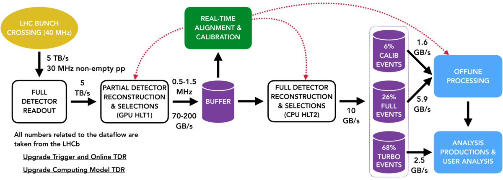

# LHCb data flow in Run 3



* Understand the changes to the LHCb data flow for Run 3
* Learn the key concepts on the HLT, Sprucing



## LHCb upgrade

In Run 1 & 2 LHCb proved itself not only to be a high-precision
heavy flavour physics experiment, but also extended the core physics programme to many different areas such as electroweak physics and fixed-target experiments. This incredible precision led to
over 500 papers including breakthroughs such as the first discovery of $C\!P$-violation in charm and the first observation of the decay $B_s^0\to \mu^+\mu^-$ among many others.

In order to reach even higher precision the experiment aims to take $50\,\mathrm{fb}^{-1}$ of
data in Run 3 by increasing the instantaneous luminosity by a factor of five.
To be capable of dealing with the higher detector occupancy the experiment will be equipped with an entire new set of tracking detectors with higher granularity and improved radiation tolerance.

One of the most important upgrades in Run 3 will be the removal of the LHCb L0 hardware triggers. As described in the following, this will bring significant changes in the data flow of the experiment both for online and offline processing. It also means that the front-end and readout electronics of all sub-detectors will be replaced, to be able
to operate at the bunch crossing rate of $40\,\mathrm{MHz}$, as well as the photodetectors of the RICH1 detector. 

## Upgrade of the LHCb trigger system

The trigger layout for Run 3 will look like this:



The LHCb trigger system will be fully redesigned by removing the L0 hardware trigger and moving to a fully-software based trigger. The hardware trigger has a rate limit of 1 MHz, which would be a limitation with the increase in luminosity. Such a low rate could be only achieved by having tight hardware trigger thresholds on $p_\mathrm{T}$ and $E_\mathrm{T}$ which is inefficient especially for fully hadronic decay modes. The removal of this bottleneck means that the full detector readout as well as running the HLT1 needs to be enabled at the average non-empty bunch crossing rate in LHCb of $30\,\mathrm{MHz}$, a not so trivial computing challenge!

As we saw already at the [Run 1 and Run 2 dataflow lecture](https://lhcb.github.io/starterkit-lessons/first-analysis-steps/dataflow.html), the software trigger is implemented in two steps: the HLT1 which performs partial event reconstruction and simple trigger decisions to reduce the data rate, and HLT2, which performs the more computationally expensive full reconstruction and complete trigger selection. One of the most important tasks of building the events is track reconstruction, which is an inherently parallelizable process. For this purpose, HLT1 in Run 3 is implemented as part of the ```Allen project``` and run on GPUs.

### The HLT architecture
Data from the various subdetectors are received in the central Data Acquisition (DAQ) system of LHCb by custom Field Programmable Gate Array (FPGA) cards, called PCIe40. A set of servers, the Event Builder (EB), then pieces together fragments of raw data information from the subdetectors to form events and group them into packets. The event packets are then passed to an Event Filtering Farm (EFF) for further processing, and events passing the selection end up in storage. The existing HLT architecture of LHCb is well suited for the requirements of GPUs and can be easily adapted to host them in the Event Builder. HLT1 will reduce the data rate by a factor of 30, and implementing it already at the EB level will greatly minimize the size of the network needed for the following steps. 

Having the HLT1 run on GPUs imposes some different requirements on the code development. The `Allen` framework is based on the `CUDA` GPU programming platform. Developers should keep in mind that HLT1 algorithms should be implemented in a way that maximizes parallelizability and is thread-safe, i.e. memory should be accessed in a secure way from parallel processes. Documentation on how to develop reconstruction algorithms and selection lines for HLT1 can be found in the readme's of the [Allen project](https://gitlab.cern.ch/lhcb/Allen).

The raw data of events selected by HLT1 is passed on to the buffer system and stored there. The buffering of events enables to run the real-time alignment and calibration before events are entering HLT2. This is crucial because in this way calibration and alignment constants obtained can be used in the full event reconstruction performed in HLT2. For the determination of these constants, HLT1 selects dedicated calibration samples. 
More information about the real-time alignment and calibration can be found in the [Upgrade Alignment TWIKI page](https://twiki.cern.ch/twiki/bin/view/LHCb/AlignmentInUpgrade).

The total bandwidth that can be saved from HLT2 to tape is limited to $10\,\mathrm{GB}/s$. An important change in the HLT2 selections with respect to the Run 2 will be the increased use of the Turbo model. Wherever possible, the Turbo will be the baseline, so that in total for approximately 2/3 of data only the data of the signal candidate (raw and reconstructed) will be saved and no further offline reconstruction will be possible. This results in significantly smaller event sizes so that more events can be saved.

More details about HLT2 selections can be found in the [Moore documentation](https://lhcbdoc.web.cern.ch/lhcbdoc/moore/master/index.html).

### Selective persistency

Besides the events that are processed by the Turbo stream, there are cases for persisting extra information of the raw data. For some decay modes, it cannot be avoided to save the full raw data, whereas for others few extra information is needed. In case of persisting the full raw and reconstructed data of the event HLT2 line can be run by setting the flag `persistreco=True`. When full event information is not required objects can be persisted selectively by defining `extra_outputs`, which can be among the following: 

* extra reconstructed tracks
* ECAL clusters for neutral objects
* ...

## Offline data processing

Events that have passed HLT2 and have been saved to tape are further processed offline by running through the Sprucing application. After passing the Sprucing events are saved on disk. For events from the Turbo stream, the default model is to run through the Sprucing only in a passthrough sprucing selection, whereas others can undergo a tighter selection by running through a sprucing line. This is necessary because the total bandwidth for events that can be saved on disk is only 3.6GB/s, whereas for saving data from HLT2 to tape 10GB/s are available. Data that is saved to disk will be provided in streams dedicated to specific physics applications.

HLT2 and sprucing selections share the same code base, so that selection lines can be interchanged among the two flexibly.


### Changes to DaVinci

As in Run 2, the DaVinci application is used to produce tuples for offline user analysis from the different physics streams. DaVinci itself is being redesigned to address the following issues:

* storage and computing resources are limited and saving irrelevant variables should be avoided, especially because there will be much more data in Run 3
* consistency between online and offline selection frameworks in using ThOr functors

For this purpose the tupling tool is changed to ```FunTuple``` which allows more flexibility for users to choose only variables that are needed for the analysis and not take all variables from a specific TupleTool. After a transition certain period that is necessary to develop all demanded tupling features for ```FunTuple``` the TupleTools used in Run 2 will no longer be supported and fully removed from DaVinci. 
At the moment FunTuple supports both LoKi and ThOr functors until all relevant functors are migrated to the ThOr framework. Afterwards the use of LoKi functors will be depricated. 

For detailed information and implementation examples of ```FunTuple``` and offline data processing in Run 3 see the [DaVinciExamples](https://gitlab.cern.ch/lhcb/DaVinci/-/blob/master/DaVinciExamples/python/DaVinciExamples/tupling/example-tupling-advanced-run-mc.py) and [DPA documentation](https://lhcb-dpa.web.cern.ch/lhcb-dpa/index.html).
