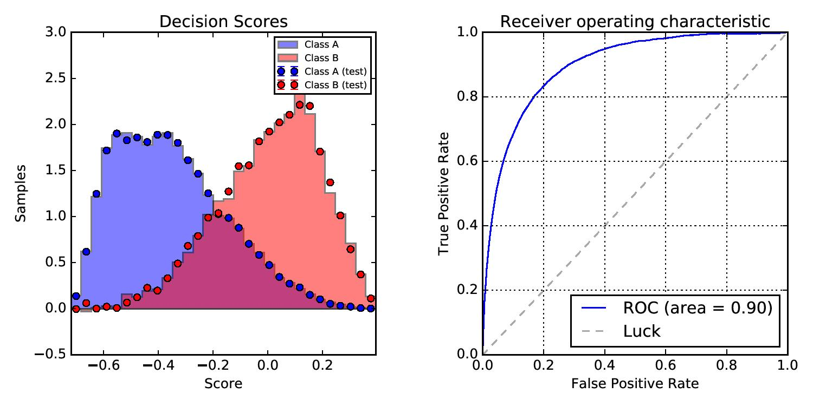
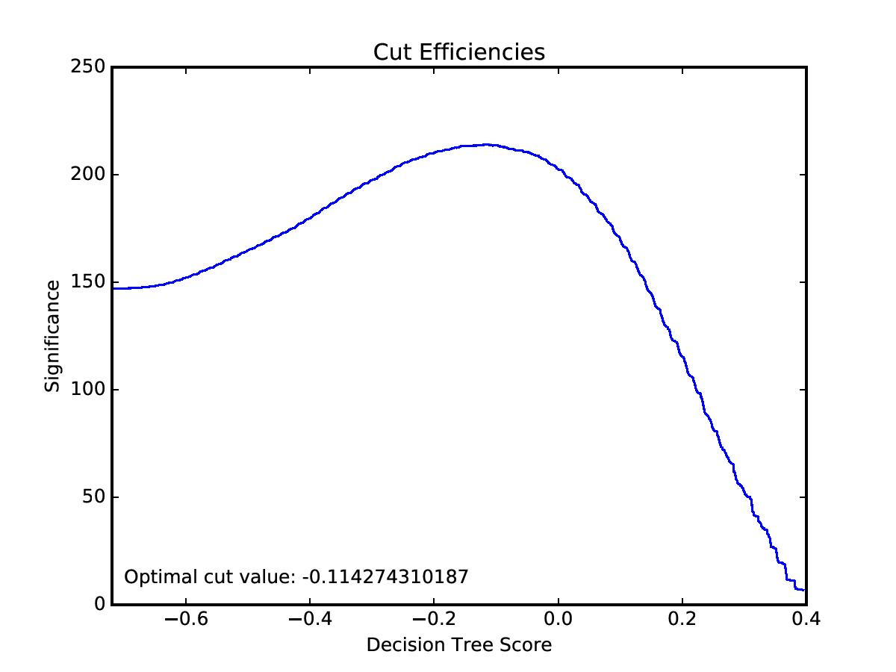

# Multivariate Analysis with SciKit Learn


* Introduction to Multivariate Analysis and SciKit Learn
* Boosted Decision Trees
* Run an example
* Learn how to use different decision tree classifiers such as AdaBoost


A machine learning problem consists of predicting properties from unknown data from a set of known data samples. Multivariate data has several attributes or features. A classification problem is where samples belong to two or more classes; we want to learn from known data how to predict the class of unkown data. For example, an event will either belong to signal or background class. We can use certain variables with well defined regions of signal or background in order to classify an event as either signal or background.

Decision Trees are a method for classification. SciKit Learn provides tools such as Decision Tree methods for Multivariate Analysis. The `DecisionTreeClassifier` can perform multivariate classification on a dataset. `DecisionTreeClassifier` takes two arrays as input: array X of size [nsamples,nfeatures] and array Y of integer values of size nsamples.

First we need to import our dataset and create an array using `root_pandas` (if you need any help with `root_pandas` please ask Chris Burr). First check you have `root_pandas` installed, you can read the documentation and how to install [here](https://github.com/scikit-hep/root_pandas). Here I have added some control variables and the sWeights as the columns in our array. The control variables are chosen on their discriminating power between signal and background. The sWeights are the probablility of an event being signal-like or background-like.

```python
from root_pandas import read_root

columns=['c_PT_mu', 'c_PT_D0', 'c_BPVCORRM_B', 'c_DIRA_B', 'c_VTX_CHI2_NDOF_B', 'c_VTX_CHI2_NDOF_D0', 'c_OWNPV_CHI2_B', 'sWeight_sig', 'sWeight_bkg']
df = read_root('./D02KSPiPi-SKexample.root', 'dataNew',columns=columns)

w = np.concatenate([df['sWeight_sig'], df['sWeight_bkg']])
training_columns = ['c_PT_mu', 'c_PT_D0', 'c_BPVCORRM_B', 'c_DIRA_B', 'c_VTX_CHI2_NDOF_B', 'c_VTX_CHI2_NDOF_D0', 'c_OWNPV_CHI2_B']
X = df[training_columns].values
Y = np.concatenate([np.ones(len(X)),np.zeros(len(X))])
X = np.concatenate([X,X])

from sklearn.cross_validation import train_test_split

X_train, X_test, Y_train, Y_test, w_train, w_test = train_test_split(X, Y, w, test_size=0.5, random_state=42)

```

We split the data into so-called training and test samples, this randomly splots the data into training and test sub-samples in order to apply the classification algorithm on each sample to avoid biases.

An example of a Decision Tree clasiffier in SciKit Learn is the `AdaBoostClassifier`; here we fit the classifier using the training set X and Y with weights w.

```python
from sklearn.ensemble import AdaBoostClassifier
from sklearn.tree import DecisionTreeClassifier

dt = DecisionTreeClassifier(max_depth=1)
bdt = AdaBoostClassifier(dt, algorithm="SAMME", n_estimators=50, learning_rate=0.5)

bdt.fit(X_train, Y_train, w_train)

```

After being fitted, the model can then be used to predict the class of samples:

```python
bdt.predict(X_train)

```

You can print the classification report using `classification_report` which builds a text report showing the main classification metrics. It is also useful to plot the area under the ROC curve. For example:

```python
Y_predict = bdt.predict(X_train)
print classification_report(Y_train, Y_predict, target_names=["background", "signal"])
print "Area under ROC curve: %.4f"%(roc_auc_score(Y_train, bdt.decision_function(X_train)))

```

You should see some output like this:

```
             precision    recall  f1-score   support

 background       0.50      0.84      0.63    233927
     signal       0.50      0.16      0.25    234251

avg / total       0.50      0.50      0.44    468178

Area under ROC curve: 0.5002

```

Now we use the `decision_function` method to return the decision tree score of the input training sample X.

```python
bdt.decision_function(X_train)

```

Add this to your code in order to make a plot of the decision tree score.

```python
twoclass_output = bdt.decision_function(X_train)
plot_range = (twoclass_output.min(), twoclass_output.max())
test_output = bdt.decision_function(X_test)

plot_colors = "br"
class_names = "AB"

import matplotlib.pyplot as plt

plt.figure()

for i, n, c in zip(range(2), class_names, plot_colors):
    plt.hist(twoclass_output[Y_train == i],
             bins=30,
             range=plot_range,
             weights=w_train[Y_train == i],
             facecolor=c,
             label='Class %s' % n,
             alpha=.5,
             edgecolor='k',
             normed=True,
             histtype='stepfilled')
    hist, bins = np.histogram(test_output[Y_test == i],
                              bins=30,
                              range=plot_range,
                              normed=True,
                              weights=w_test[Y_test == i])
    scale = len(test_output)/sum(hist)
    err = np.sqrt(hist*scale)/scale
    width = (bins[1] - bins[0])
    centre = (bins[:-1] + bins[1:])/2
    plt.errorbar(centre, hist, yerr=err, fmt='o', c=c, label='Class %s (test)' % n)

x1, x2, y1, y2 = plt.axis()
plt.axis((x1, x2, y1, y2 * 1.2))
plt.legend(loc='upper right', fontsize='x-small')
plt.xlim([plot_range[0],plot_range[1]])
plt.ylabel('Samples')
plt.xlabel('Score')
plt.title('Decision Scores')

plt.show()

```

A Reciever Operating Characteristic (ROC) curve can be used to evaluate the quality of the classifier output. ROC curves typically feature true positive rate on the Y axis, and false positive rate on the X axis. This means that the top left corner of the plot is the “ideal” point - a false positive rate of zero, and a true positive rate of one. This means that ROC curves with a larger area underneath are usually better. You can plot the ROC curve of our classifier to evaluate the performance:

```python
from sklearn.metrics import roc_auc_score, roc_curve, auc

fpr, tpr, thresholds = roc_curve(Y_test, test_output, sample_weight=w_test)
roc_auc = auc(fpr, tpr, reorder=True)

plt.figure()

plt.plot(fpr, tpr, lw=1, label='ROC (area = %0.2f)'%(roc_auc))

plt.plot([0, 1], [0, 1], '--', color=(0.6, 0.6, 0.6), label='Luck')
plt.xlim([0.0, 1.0])
plt.ylim([0.0, 1.0])
plt.xlabel('False Positive Rate')
plt.ylabel('True Positive Rate')
plt.title('Receiver operating characteristic')
plt.legend(loc="lower right")
plt.grid()

plt.show()

```

Your plots should look something like this:



 Try using another Boosted Decision Tree Classifier on the data. Plot the decision tree scores and the ROC curve and compare the performance of each classifier. This could be done by plotting the ROC curves for each classifier on the same plot and comparing the area under the ROC curves. For some ideas for different classifiers look [here](http://scikit-learn.org/stable/modules/ensemble.html).


Once we have the decision tree scores we can decide on a cut to make on the output of the BDT. Different so-called 'figures of merit' can be used to decide on the optimal cut, some are discussed [here](https://arxiv.org/pdf/physics/0308063.pdf). For the purpose of this lesson we will choose to maximise the significance $$ S/\sqrt(S+B) $$. This can be done in SciKit Learn by plotting the significance against the decision tree score; the optimal cut on the decision tree score will be at the point of maximum significance. This can be done using the SciKit Learn `roc_curve` class which returns the efficiencies (true positive rate and false positive rate) for values of the BDT score. We will plot the significance for values of the decision tree score.

```python
sig = df['sWeight_sig'].sum()
nsig = tpr[1:]*sig
bkg = df['sWeight_bkg'].sum()
nbkg = fpr[1:]*bkg
significance = nsig/np.sqrt(nsig+nbkg)

index = np.argmax(significance)
cut = thresholds[index]

plt.figure()

plt.plot(thresholds[1:], significance)
plt.xlim(xmin=thresholds.min())
plt.xlabel('Decision Tree Score')
plt.ylabel('Significance')
plt.title('Cut Efficiencies')
plt.text(-0.7,10,'Optimal cut value: ' + str(cut),fontsize=12)
plt.savefig('significance_bdtscore.pdf')
plt.show()

print 'Optimal cut value: ', cut

```

You  should get the optimal cut on the BDT in order to maximise the significance:

```
Optimal cut value:  -0.114274310187

```

And your plot should look something like this:

