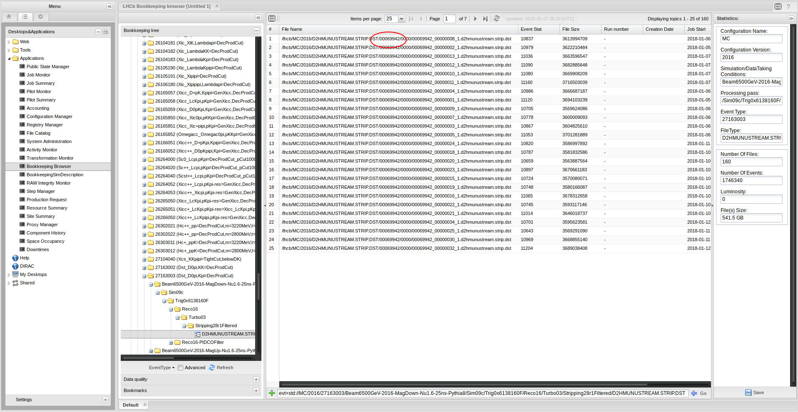

u Generating signal decays


* Understand how a signal decay sample is produced in the LHCb framework
* Produce generator level Monte Carlo, print the decay tree and produce nTuples
* Read a DecFile and understand what it produces, including generator level cuts
* Filter a simulated sample to reduce disk space needed
 

## What is Gauss?

The LHCb simulation framework which steers the creation of simulated events and interfaces to multiple external applications. Most commonly, an event is created via the following procedure:

1. The `ProductionTool` (Pythia, GenXicc, ...) generates an event with the required signal particle. Either by generating minimum bias events until a matching particle is found or by ensuring one is produced in every event. The resulting event is comprised of either stable particles or unstable particles which are known to either EvtGen or Geant4 and can be decayed.
2. The signal particle is decayed using the `DecayTool` (EvtGen) to the desired final state, all remaining unstable particles are decayed independently.
3. The signal and its decay products might be required to pass generator level cuts implemented as a `CutTool`.
4. Particles are transported through the detector simulation.


1. The detector simulation is **__by far__** the most time consuming step (minutes, compared to seconds for the rest). So make sure your generator cuts remove events you cannot possibly reconstruct or select later on. Additional options are available to increase the speed, please talk to your MC liaisons!
2. The generator cuts are only applied to the signal that was forced to decay to the specific final state. _Any_ other true signal candidate is not required to pass.
3. The number of generated events refers to the number entering step 4 above, so those passing the generator level cuts. __Not__ the number of events produced by the `ProductionTool` in the first step.


## Figuring out which option files to use and how to run Gauss

Imagine you need to know the option files and software versions used for a simulated sample you have found in the bookkeeping, e.g.
```
/MC/2015/Beam2510GeV-2015-MagDown-Nu1.5-25ns-Pythia8/Sim09b/Trig0x4115014e/Reco15a/Turbo01aEM/Stripping22NoPrescalingFlagged/27163003/ALLSTREAMS.DST
```
First, find the ProductionID:



Search for this ID in the Transformation Monitor, right click the result and select "Show request". Right clicking and selecting "View" in the new window will open an overview about all the individual steps of the production with their application version and option files used.


`'$DECFILESROOT/options/27163003.py' '$LBPYTHIA8ROOT/options/Pythia8.py'` 
produces the sample using Pythia 8 while `'$LBPYTHIA8ROOT/options/Pythia8.py' 
'$DECFILESROOT/options/27163003.py'` uses Pythia 6.


The production system handles the necessary settings for initial event- and runnumber and the used database tags. In a private production, you need to set these yourself in an additional options file, containing, for example:
```python
from Gauss.Configuration import GenInit

GaussGen = GenInit("GaussGen")
GaussGen.FirstEventNumber = 1
GaussGen.RunNumber = 1082

from Configurables import LHCbApp
LHCbApp().DDDBtag = 'dddb-20150724'
LHCbApp().CondDBtag = 'sim-20160623-vc-md100'
LHCbApp().EvtMax = 5
```

Assuming this is saved in a file called `Gauss-Job.py` and following the example above, the sample can then be produced by running

```shell
lb-run Gauss/v49r7 gaudirun.py '$APPCONFIGOPTS/Gauss/Beam2510GeV-md100-2015-nu1.5.py' \
    '$APPCONFIGOPTS/Gauss/DataType-2015.py' \
    '$APPCONFIGOPTS/Gauss/RICHRandomHits.py' \
    '$DECFILESROOT/options/27163003.py' \
    '$LBPYTHIA8ROOT/options/Pythia8.py' \
    '$APPCONFIGOPTS/Gauss/G4PL_FTFP_BERT_EmNoCuts.py' \
    '$APPCONFIGOPTS/Persistency/Compression-ZLIB-1.py' \
    Gauss-Job.py
```

This would take 5 to 10 minutes due to the detector simulation, which can be turned off by adding `'$GAUSSOPTS/GenStandAlone.py'` as one of the option files.

## Setting up a new Decay

EvtGen is completely controlled via a specific file for each sample, known as a DecFile. Non-signal decays are produced according to DECAY.DEC, which contains all known (measured + some predicted) hadron decays. These live in the [DecFiles package](https://gitlab.cern.ch/LHCb-SVN-mirrors/Gen-DecFiles/tree/master/dkfiles)
To understand what is produced in any simulated sample, you need to understand these. First, how to try them out.

The procedure for testing and committing decfiles is well documented on [TWiki](https://twiki.cern.ch/twiki/bin/view/LHCb/GaussDecayFiles)
The TWiki page still uses the old `SetupProject` approach. Instead, we will adapt this to use the new `lb-run` and `lb-dev` approach. First we need to create a Gauss developement environment:
```shell
lb-dev --name GaussDev_ImpactKit Gauss/v49r7
cd GaussDev_ImpactKit
```
To modify or add a dec file, we need the DecFiles package which is still on svn:
```shell
getpack Gen/DecFiles head
make
```
This will populate the `./Gen/DecFiles/Options` directory with an python options file to generate events for each decfile, `(eventtype).py`. The location where the dec files are located is stored in `$DECFILESROOT` and we can check that the correct on is used by running
```shell
./run $SHELL -c 'echo $DECFILESROOT'
```
which should point `Gen/DecFiles` directory in the current development environment.


Note that recompiling will not overwrite existing options file, it is necessary to remove by hand all of the python files in `./Gen/DecFiles/Options`.


After this, to produce some generator level events:
```shell
./run gaudirun.py Gauss-Job.py '$GAUSSOPTS/GenStandAlone.py' '$DECFILESROOT/options/11164001.py' '$LBPYTHIA8ROOT/options/Pythia8.py'
```

This will output a .xgen file containing simulated events, as well as a root file containing various monitoring histograms you will probably never want to look at.  
As stated above, note that the number of events produced is *after generator level cuts* - this is also true for production requests.

The .xgen file can be processed into something more usable with DaVinci:
```python
"""Configure the variables below with:
decay: Decay you want to inspect, using 'newer' LoKi decay descriptor syntax,
decay_heads: Particles you'd like to see the decay tree of,
datafile: Where the file created by the Gauss generation phase is, and
year: What year the MC is simulating.
"""
# https://twiki.cern.ch/twiki/bin/view/LHCb/FAQ/LoKiNewDecayFinders
decay = "[ [B0]cc => ^(D- => ^K+ ^pi- ^pi-) ^pi+]CC"
decay_heads = ["B0", "B~0"]
datafile = "Gauss-11164001-5ev-20170504.xgen"# N.B output filename includes today's date - change this!
year = 2012


from Configurables import (
    DaVinci,
    EventSelector,
    PrintMCTree,
    MCDecayTreeTuple
)
from DecayTreeTuple.Configuration import *


# For a quick and dirty check, you don't need to edit anything below here.
##########################################################################

# Create an MC DTT containing any candidates matching the decay descriptor
mctuple = MCDecayTreeTuple("MCDecayTreeTuple")
mctuple.Decay = decay
mctuple.ToolList = [
    "MCTupleToolHierarchy",
    "LoKi::Hybrid::MCTupleTool/LoKi_Photos"
]
# Add a 'number of photons' branch
mctuple.addTupleTool("MCTupleToolKinematic").Verbose = True
mctuple.addTupleTool("LoKi::Hybrid::TupleTool/LoKi_Photos").Variables = {
    "nPhotos": "MCNINTREE(('gamma' == MCABSID))"
}

# Print the decay tree for any particle in decay_heads
printMC = PrintMCTree()
printMC.ParticleNames = decay_heads

# Name of the .xgen file produced by Gauss
EventSelector().Input = ["DATAFILE='{0}' TYP='POOL_ROOTTREE' Opt='READ'".format(datafile)]

# Configure DaVinci
DaVinci().TupleFile = "DVntuple.root"
DaVinci().Simulation = True
DaVinci().Lumi = False
DaVinci().DataType = str(year)
DaVinci().UserAlgorithms = [printMC, mctuple]
```
```shell
lb-run DaVinci/v41r0 gaudirun.py DaVinciOptions.py
```
This script will attempt to build an nTuple from the xgen file it is given, using the specified decay descriptor. If everything is working correctly, this should return at least one entry per event, corresponding to your signal candidate. The PrintMCTree algorithm will print to screen the full decay chain for each particle in "decay_heads" e.g:
```
<--------------------------------- MCParticle --------------------------------->
                Name         E         M         P        Pt       phi        Vz
                           MeV       MeV       MeV       MeV      mrad        mm
B~0                 228676.20   5279.58 228615.24   4575.10   3122.65    -18.05
+-->D-              220232.04   1869.61 220224.11   4909.35  -2995.39     96.91
|+-->K+             150522.77    493.68 150521.97   3531.59   3092.01    120.50
|+-->pi-             12700.02    139.57  12699.26    351.94  -2113.03    120.50
|+-->pi-             57009.20    139.57  57009.03   1290.27  -2667.72    120.50
|+-->gamma               0.05      0.00      0.05      0.00      0.00    120.50
+-->pi+               8444.15    139.57   8443.00    850.25   1231.87     96.91
```
, which is extremely helpful for knowing if your decfile is producing what you think it should. Note that in addition to your signal B0, it will also print out the decay chain for any B0 in the event, so you will regularly see other random B decays.

## DecFiles

```
# EventType: 11146031
#
# Descriptor: [B0 -> (J/psi(1S) -> mu+ mu-)  (K*0 -> K+ pi-) (phi -> K+ K-)]cc
#
# NickName: Bd_JpsiphiKst,KKmumuKpi=DecProdCut
#
# Cuts: DaughtersInLHCb
#
# CPUTime: < 1 min
#
# Documentation:  Bd decay to Jpsi(to mu+ mu-), phi(to K+ K-) Kst(K+ pi-) with K+,K-,mu,mu,K+,pi- in acceptance
# EndDocumentation
#
# PhysicsWG: B2Ch 
# Tested: Yes
# Responsible: Alessia Satta
# Email: alessia.satta@cern.ch
# Date: 20160514
#
```
The information in the header is not just bookkeeping, almost all of it is parsed and changes what you get out at the end. The EventType is a series of flags which controls the generation. The rules for this are described in detail in [LHCb-2005-034](https://cds.cern.ch/record/855452/files/lhcb-2005-034.pdf)
For example for the first digit of 1 = contains b quark, 2 = c quark, 3 = min bias...
Similarly, the document specifies the conventions for the "NickName" - which also has to be the filename. Note that once MC has been produced from a given DecFile, it is not allowed to be changed, so you never need to worry about which version of DecFiles you are looking at when trying to understand existing samples.

The "Cuts" field specifies which one of a predetermined set of cut tools are used. The best way to understand these is to look at the source code:
https://gitlab.cern.ch/lhcb/Gauss/blob/master/Gen/GenCuts/

## Generator level cuts

Detector simulation is computationally expensive, and event generation is comparatively fast. Cuts at generator level save a huge amount of CPU and disk space (which means you can have more actually useful events) almost for free. At generator level you can only cut on pre-resolution quantities, so normally you want the generator cuts to be 100% efficient for selected events (within epsilon). The default example is to immediately remove events where the daughters are far outside the LHCb acceptance.
This is implemented in "DaugthersInLHCb", aka "DecProdCut" in the NickName. This requires that each "stable charged particle" is in a loose region around the LHCb acceptance (10-400 mrad in Theta). 

## LoKi GenCutTool
Another method to apply generator level cuts is via the LoKi::GenCutTool. This is used via the "InsertPythonCode" command in the header, which allows to write python code which is inserted into the options file:
```
# EventType: 11574020
#
# Descriptor: {[[B0]nos => nu_mu mu+ (D*(2010)- => (D~0 -> K+ pi-) pi-)]cc, [[B0]os => anti_nu_mu mu- (D*(2010)+ => (D0 -> K- pi+) pi+)]cc}
#
# NickName: Bd_Dst+munu=TightCuts
# Cuts: 'LoKi::GenCutTool/TightCut'
# InsertPythonCode:
#from Configurables import LoKi__GenCutTool
#from Gauss.Configuration import *
#gen = Generation()
#gen.SignalRepeatedHadronization.addTool ( LoKi__GenCutTool , 'TightCut' )
#tightCut = gen.SignalRepeatedHadronization.TightCut
#tightCut.Decay = "[ (Beauty) ==> ^(D~0 -> ^K+ ^pi- {gamma} {gamma} {gamma}) ^mu+ nu_mu {X} {X} {X} {X} {X} {X} {X} {X} ]CC"
#tightCut.Preambulo += [
#  "from LoKiCore.functions import in_range"  ,
#  "from GaudiKernel.SystemOfUnits import GeV, MeV"  ,
#  "piKP     = GCHILD(GP,('K+' == GABSID )) + GCHILD(GP,('pi-' == GABSID ))" ,
#  "piKPT     = GCHILD(GPT,('K+' == GABSID )) + GCHILD(GPT,('pi-' == GABSID ))" ,
#]
#tightCut.Cuts      =    {
# '[pi+]cc'   : " in_range( 0.010 , GTHETA , 0.400 )& ( GPT > 700 * MeV )" ,
# '[K-]cc'   : " in_range( 0.010 , GTHETA , 0.400 ) & ( GPT > 700 * MeV )" ,
# '[mu+]cc'  : " in_range( 0.010 , GTHETA , 0.400 ) & (GP > 2500* MeV) ",
# '[D~0]cc'   : "( piKP > 15000 * MeV ) & (piKPT > 2300 * MeV)"
#    }
# EndInsertPythonCode
# Documentation: B -> D*+ mu nu.  D* -> D0 pi, D0 -> K pi. Cuts for B -> D* tau nu, tau-> mu #analysis.
```
This requires the addition of "TightCut" to the nickname.

## Generator cut efficiency

The generator cut efficiency can be found from the GeneratorLog.xml file, which contains e.g:
```xml
<efficiency name = "generator level cut">
    <after> 5 </after>
    <before> 27 </before>
    <value> 0.18519 </value>
    <error> 0.074757 </error>
</efficiency>
```


## Controlling decays

To start with a simple example:

```
# EventType: 12163001
#
# Descriptor: [B+ -> (D~0 -> K+ pi-) pi+]cc
#
# NickName: Bu_D0pi,Kpi=DecProdCut
#
# Cuts: DaughtersInLHCb
#
# Documentation: 
#   Control channel for B->DK ADS and GLW analyses
# EndDocumentation
#
# PhysicsWG: B2OC
# Tested: Yes
# Responsible: Paolo Gandini
# Email: p.gandini1@physics.ox.ac.uk
# Date: 20051208
#
Alias      MyD0        D0
Alias Myanti-D0   anti-D0
ChargeConj        MyD0       Myanti-D0
#
Decay B+sig
  1.000     Myanti-D0  pi+               PHSP;
Enddecay
CDecay B-sig
#
Decay Myanti-D0
  1.000        K+        pi-                    PHSP;
Enddecay
CDecay MyD0
#
End
```
This DecFile defines a signal B+ which decays 100% to D0 pi+, and the D0 in turn decays 100% into K- pi+. Important is the definition of "MyD0". If the decay was to "D0" rather than "MyD0", the D0 would decay via all of the decay modes implemented in DECAY.DEC.
The final part of each decay is the actual physics model used - in this case "PHSP", which is phase space only (matrix element = constant). Note that with PHSP the daughters are completely unpolarized - for anything other than (spin 0) to (spin0 spin0) this will get the angular momentum wrong!

#Two body decays - getting angular momentum right
EvtGen has specific models for each two body spin configuration, for example Scalar to Vector+Scalar (SVS), and Vector to lepton+lepton(VLL)
```
#
Decay B+sig
  1.000     MyJ/psi  K+                   SVS;
Enddecay
CDecay B-sig
#
Decay MyJ/psi
  1.000     mu+  mu-                      PHOTOS  VLL;
Enddecay
```
For decays to two vectors, there is a more complicated polarization structure which needs to be specified - for example here the fraction and phase for each helicity are set according to measured values:
```
Define Hp 0.159
Define Hz 0.775
Define Hm 0.612
Define pHp 1.563
Define pHz 0.0
Define pHm 2.712
#
Alias      MyJ/psi    J/psi
Alias      MyK*0      K*0
Alias      Myanti-K*0 anti-K*0
ChargeConj MyK*0      Myanti-K*0
ChargeConj MyJ/psi    MyJ/psi
#
Decay B0sig
  1.000         MyJ/psi   MyK*0          SVV_HELAMP Hp pHp Hz pHz Hm pHm;
Enddecay
Decay anti-B0sig
  1.000         MyJ/psi   Myanti-K*0     SVV_HELAMP Hm pHm Hz pHz Hp pHp;
Enddecay
```

#3+ bodies
For 3+ bodies the physics models get more complicated. For a fully hadronic final state, typically a Dalitz model will be specified, e.g:
```
# D_DALITZ includes resonances contributions (K*(892), K*(1430), K*(1680))
Decay MyD-
  1.000    K+        pi-    pi-          D_DALITZ;
Enddecay
CDecay MyD+
```
Any time you see a 3+ body decay with the PHSP model, you know it will be very far from reality. If you have no other information sometimes this is the best you can do, though.

A semileptonic decay would typically be produced according to some form factor model, e.g
```
Decay B0sig 
# FORM FACTORS as per HFAG PDG10
   1   MyD*-        mu+  nu_mu         PHOTOS  HQET 1.20 1.426 0.818 0.908;
  #
Enddecay
CDecay anti-B0sig
```
here the numbers correspond to measured values for the form factor parameters. 
## Cocktail decays
Often you will want to simulate more than one decay mode in a sample, e.g:
```
Decay MyD_s+
 0.0259 phi      mu+     nu_mu                      PHOTOS  ISGW2;
 0.0267 eta      mu+     nu_mu                      PHOTOS  ISGW2;
 0.0099 eta'     mu+     nu_mu                      PHOTOS  ISGW2;
 0.0037 K0       mu+     nu_mu                      PHOTOS  ISGW2;  
 0.0018 K*0      mu+     nu_mu                      PHOTOS  ISGW2;
 0.0020 f_0      mu+     nu_mu                      PHOTOS  ISGW2; 
 0.0059 mu+      nu_mu                              PHOTOS   SLN; 
Enddecay
CDecay MyD_s-
```
Note that the fractions will always be renormalised to sum to 1 - you can directly use PDG branching fractions without having to rescale by hand.

## Final state radiation
After generating the decay, final state radiation is added using PHOTOS. Note that PHOTOS is enabled by default, even though many decfiles explicitly specify it. It needs to be explicitly removed via "noPhotos"


## Changing particle masses / lifetimes/ widths
Sometimes you need to change the mass or lifetime of a particle, either because the initial values are wrong, or the particle you actually want doesn't exist in EvtGen, and you need to adapt an existing particle.
This can be done with python code inserted in the header:

```
# InsertPythonCode:
#from Configurables import LHCb__ParticlePropertySvc
#LHCb__ParticlePropertySvc().Particles = [ 
# "N(1440)+              636       12212   1.0      1.4400000      2.194041e-24                 N(1440)+           21440      0.00",
# "N(1440)~-             637      -12212  -1.0      1.4400000      2.194841e-24                   anti-N(1440)-           -21440      0.00",
#"N(1520)+              420        2124   1.0      1.52000000      5.723584e-24                   N(1520)+           21520      0.00",
# "N(1520)~-             421       -2124  -1.0      1.52000000     5.723584e-24                   anti-N(1520)-           -21520      0.00",
#"N(1535)+              713       22212   1.0      1.53500000      4.388081e-24                   N(1535)+           21535      0.00",
#"N(1535)~-             714      -22212  -1.0      1.53500000      4.388081e-24                   anti-N(1535)-           -21535      0.00",
#"N(1720)+              775       32124   1.0      1.72000000      2.632849e-24                   N(1720)+           21720      0.00",
#"N(1720)~-             776      -32124  -1.0      1.72000000      2.632849e-24                   anti-N(1720)-           -21720      0.00"
#]
# EndInsertPythonCode
```
The format is: 
```
#                    GEANTID    PDGID  CHARGE   MASS(GeV)      TLIFE(s)                    EVTGENNAME    PYTHIAID    MAXWIDTH
```

## Filtering a simulated sample

For larger production requests, the amount of disk space required to store the sample becomes a problem. Therefore, a filtering of the final candidates obtained after the stripping step in the MC production can be applied. As this does not reduce the CPU requirements, filtering steps are best accompanied by a matching (but looser) set of generator cuts.

Assuming we have a sample of simulated D*+ -> D0( -> K pi ) pi which we would like to filter on the Turbo line `'Hlt2CharmHadD02KPi_XSecTurbo'`:

```python
from GaudiConf import IOHelper
IOHelper().inputFiles(
   ['root://eoslhcb.cern.ch//eos/lhcb/grid/prod/lhcb/MC/2015/ALLSTREAMS.DST/00057933/0000/00057933_00000232_3.AllStreams.dst'],
    clear=True)
```

We also do not need any events where the D0 candidate has a transverse momentum less than 3 GeV. We already know how to write the filter for this:
```python
from PhysSelPython.Wrappers import AutomaticData, SelectionSequence, Selection
from Configurables import FilterDesktop

line = 'Hlt2CharmHadD02KPi_XSecTurbo'
Dzeros = AutomaticData('/Event/Turbo/'+line+'/Particles')

pt_selection = FilterDesktop(
    'D0_PT_selector', Code='PT > 3000*MeV')

sel = Selection('D0_PT_selection',
                Algorithm=pt_selection,
                RequiredSelections=[Dzeros])

selseq = SelectionSequence('D0_Filtered', sel)
```
Instead of writing a ntuple, we need to write out the events to an (m)DST which pass `selseq`. The necessary configuration is basically identical in all filtering options in use and for the DST format reads
```python
from DSTWriters.Configuration import (SelDSTWriter, stripDSTStreamConf, stripDSTElements)

SelDSTWriterElements = {'default': stripDSTElements()}
SelDSTWriterConf = {'default': stripDSTStreamConf()}

dstWriter = SelDSTWriter("TurboFiltered",
                         StreamConf=SelDSTWriterConf,
                         MicroDSTElements=SelDSTWriterElements,
                         OutputFileSuffix ='',
                         SelectionSequences=[selseq]  # Only events passing selseq are written out!
                         
from Configurables import DaVinci
DaVinci().appendToMainSequence([dstWriter.sequence()])
```
Running these options (after adding the usual `DaVinci()` options like data type, tags etc) produces the file `SelD0_Filtered.dst` and you can verify that every event has a candidate passing `'Hlt2CharmHadD02KPi_XSecTurbo'` with at least 3 GeV transverse momentum.


1. Option files need to be tested and checked by the MC liaisons.
2. Exist in the [WG](http://svnweb.cern.ch/world/wsvn/lhcb/DBASE/tags/WG) project: Lots and lots of examples.
3. More details and naming conventions on [TWiki](https://twiki.cern.ch/twiki/bin/view/LHCbPhysics/FilteredSimulationProduction)

