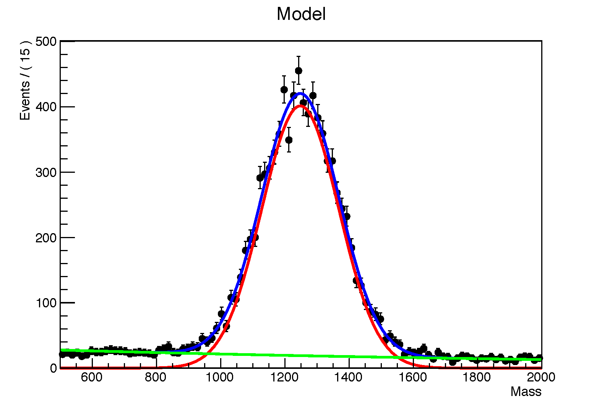

# Fitting with RooFit


* Learn how to generate data. 
* Learn how to fit using RooFit.
* Learn a few complex tools.
 

In the next few paragraphs, we will present how to fit some data composed of a signal component and a background component. 
Before fitting, we should ask ourselves the following questions: 

- What should our signal look like? 
- What does our signal really look like? Do we have to include a resolution/acceptance to our PDF?
- What does our background look like? 

After having answered these points, we can start writing our fitting code. 

Generally, data is imported from a ROOT file and the fits are carried on from variables of the corresponding tree. In the following example we will randomly generate data so that the code can be run without any external input.
In this tutorial, we generated two different data samples. One is binned and the other one unbinned, and the combined unbinned data sample is fitted. 

[`RooDataHist`](https://root.cern.ch/doc/master/classRooDataHist.html) and [`RooDataSets`](https://root.cern.ch/root/html516/RooDataSet.html) are RooFit data storage containers. RooDataSet is used for unbinned datasets while RooDataHist is the binned equivalent.
 

Binned means that the number of events is counted in each bin and the fits are carried on using this information. This implies that the result of the fit will depend on the number of bins that is chosen. In the case of an unbinned dataset, each event position is taken into account and the fit results will not depend on a given number of bins. Using RooDataHist will often result much faster. Imagine performing an unbinned fit using tens of millions of events, it can sometimes take hours!
 

`RooDataHist` and `RooDataSet` are declared in very similar ways, except that RooDataHist is built from a TH (TH1, TH2, etc…, the binned ROOT histograms) while RooDataSet is built directly from variables of a TTree. 
There are various ways to build these two objects (that you can find in various examples on the web) and we will show one possibility. 

````
RooDataSet data("Imported_variable", "Imported_variable", read_tree, mass);
RooDataHist signal ("signal_curve", "signal ditribution", mass,  histo_signal);
````

with `mass` being a `RooRealVar`.

RooFit also offers the possibility to generate data both in a binned and unbinned fashion. This is a very useful tool to test fit models without having to load millions of events from a Tree. This data should follow a statistical model (gaussian, exponential, etc…) in the form of a RooAbsPdf. 

````
RooGaussian gaus ("RooFit_Gaussian", "RooFit_Gaussian", mass, mean, sigma);
RooExponential expo("RooFit_exponential", "RooFit_exponential", mass, slope);
````

where `mass`, `mean`, `sigma` and `slope` are `RooRealVar` objects. 
Here the gaussian will correspond to a fit to the signal and the exponential to a fit to the background. 

The binned and unbinned datasets can then be creating using the generate and generateBinned methods. We generate 10000 events:

````
RooDataSet* d = gaus.generate(mass, 10000);
RooDataHist* d_binned = gaus.generateBinned(mass, 10000);
````

We can then create a model that sums the signal and background components using the `RooAddPdf` method. It is possible to specify both signal and background abundances, or only the relative fraction (as in this case). In this case, we want the relative signal abundance to be at the level of 80%:

````
RooRealVar N_f("N_f", "Signal relative abundance", 0.8);
RooAddPdf model1("Total_model", "Total generation model", gaus, expo, N_f);
````

We can now have a customised `RooDataSet` that mixes signal and background and save the `RooDataSet` as a ROOT Object.

````
RooDataSet* d = model1.generate(mass, 10000);
const TTree* write_tree = d -> tree();
write_tree -> Write();
````

Now let's fit! `

RooFit allows us to perform complicated fits. It is built around solid statistical tools. Its default method uses a log likelihood minimisation thanks to [Minuit](https://seal.web.cern.ch/seal/snapshot/work-packages/mathlibs/minuit/) (a very old piece of code that is still used today). 
The fit will be binned if you use RooDataHist and unbinned if you choose RooDataSet.
To fit, it is quite easy and it can be done in different ways: 

- Fit directly to data, using the following method which return a [`RooFitResult`](https://root.cern.ch/doc/v612/classRooFitResult.html) object:


It is very important to take time to read the output of the fit that appears on the terminal. A fit can sometimes be displayed eventhough it does not converge. 
Messages like "err matrix not pos-def", "no error matrix", or "p.d.f value is less than zero (-0.000000), forcing value to zero" clearly show that something is wrong!
 

````
RooFitResult* result_unbinned = model_unbinned.fitTo(data, Save(True)); in this case Minuit is called by the function fitTo
````

- Write a chi2 or a maximum likelihood function and then call Minuit directly

````
RooChi2Var * chi2 = new RooChi2Var("chi2","chi2",*model_unbinned,*data,NumCPU(8), Extended(kTRUE)) ; 
//where NumCPU(8) is the number of CPUs used in the Fit
//Extended(kTRUE) means that the fit is extended
RooMinuit m1(*chi2) ;
m1.setVerbose(kTRUE); //write info on log
m1.setPrintLevel(3); //write all the information on the development on the shell/log
//  m1.setEps(1e-15);//set the precision to a known value
m1.setStrategy(1); //0, 1 or 2 depending on the function to minimise
m1.migrad(); //call migrad for first derivative
m1.hesse(); //call hesse for second derivative (more precise)
m1.save()->Print("v"); //print values
````

For more information, click [here](https://root.cern.ch/doc/master/classRooMinuit.html#a73477af6d519f8b91ab0538bee1fc2f8)


In more complicated fit where there are more than three parameters, it is good habit to collect them in a .txt file(`params_to_fit.txt`), in order to set them to their initial value in a more comfortable way. The set of parameters of the fit can be defined after the definition of the model as a `RooArgSet`.

````
RooArgSet* params = model_unbinned->getParameters(RooArgSet(mass)) ;
TString param_file_name = "params_to_fit.txt";
params->readFromFile( param_file_name );
````

The parameters file params_to_fit.txt has the form:

````
mean_guess =  1250  L (1225 - 1275)
sigma_guess =  100 L (50 - 200)
N_f = 0.8 C L (0.7 - 0.9)
````

where L and C stands for free and constraint respectively. In this way it is possible to set the parameters to their initial value or to free them. Following the fit, the parameters can be saved in another .txt file (or the same one, which could be updated):

````
params->writeToFile("params_after_fit.txt")
````

The parameters then become: 

````
mean_guess =  1247.92 +/- 1.51723  L (1225 - 1275)
sigma_guess =  120.121e+02 +/- 1.34229 L(50 - 200)
N_f = 0.8 C L (0.7 - 0.9)
````

In order to plot the fit results data and PDFs are implemented in a [`RooPlot`](https://root.cern.ch/doc/master/classRooPlot.html).
First we have to create a `RooPlot`: 

````
RooPlot* plot2 = mass.frame(RooFit::Title("Model"));
````

Then it is important to plot on the frame, adding all of the options we want, as `LineColor`, `LineStyle`, `Name`, etc.. The signal and background components have to be added one by one: 

````
data.plotOn(plot2);
model_unbinned.plotOn(plot2);
model_unbinned.plotOn(plot2, RooFit::Components(sig_gaus), RooFit::LineColor(kRed));
model_unbinned.plotOn(plot2, RooFit::Components(bkg), RooFit::LineColor(kGreen));
````

Here is the corresponding plot: 

[](C_unbinned.png)

In order to display the output parameters of our plot, we make use of the `paramOn` method: 

````
model_unbinned->paramOn(plot2, Layout(0.6,0.89,0.89)); 
````

Moreover, it is sometimes useful to add a pull plot in order to have a clearer idea of the quality of the fit: 

````
RooHist* hpull = plot2->pullHist() ;
hpull->SetFillColor(kBlue);
RooPlot* pulls_plot = mass.frame(Title("Pull Distribution")) ;
pulls_plot->addPlotable(hpull,"BX") ;
````

If the data set is binned the pull plot needs to have the same binning, so we need to add the option

````
Int_t nBins = mass.getBin();
````

When we're dealing with a pull plot, drawing it just under the main plot is very useful. In order to do this it is possible to use TPads, which have the following syntax: 

````
TCanvas* c1 = new TCanvas("c1", "Plot");
TPad*    upperPad = new TPad("upperPad", "upperPad",   .005, .2525, .995, .995);
TPad*    lowerPad = new TPad("lowerPad", "lowerPad",   .005, .005,  .995, .2475);
lowerPad->Draw(); 
upperPad->Draw();        
upperPad->cd();
gPad->SetLogy(1);
plot2->SetMinimum(0.2);
plot2->Draw();
lowerPad->cd();
gPad->SetGrid();
pulls_plot->Draw("B");
````

The following code is a nice RooFit example and covers the various examples that we have covered: /afs/cern.ch/user/s/samarian/public/learn_RooFit.C

Sometimes we want to fit at simulateously multiple datasets. The [`RooSimultaneous`](https://root.cern.ch/doc/master/classRooSimultaneous.html) object is here to help us: 

````
RooSimultaneous simPdf("simPdf","simultaneous pdf",sample) ;
````

A full example using `RooSimultaneous` is available at this [address](https://root.cern.ch/root/html/tutorials/roofit/rf501_simultaneouspdf.C.html).

