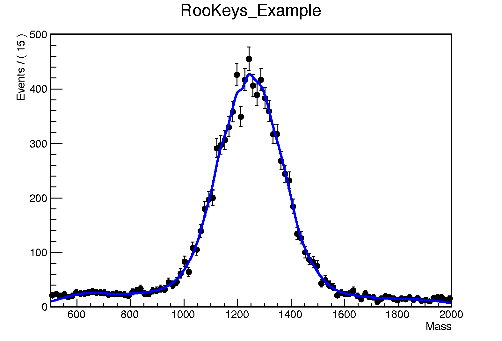

# Getting started with RooFit


* Learn the basics of RooFit.
 

RooFit is built on top of ROOT and is used by particle physicists to fit their data. It can perform very complicated fits and is considered by many as being reliable. However, RooFit’s documentation is sparse and outdated and most of the important informations are often found by users on the ROOT forums. This introduction presents on a step-by-step basis various tools which can be used for our future analysis. 

RooFit offers many features that are essential to CERN physicists:

- Plenty of pre-written Probability Density Functions (PDF, the functions used to fit our data): Gaussian, Exponential, Crystal Ball, Poissons etc… (Full list [here](https://github.com/root-project/root/tree/master/roofit/roofit/inc))
- Possibilty to build our own fit model.
- Creation of customised PDFs by adding, convoluting other PDFs. 
- Fitting of multiple datasets simultaneously. 
- Generation of Datasets, very useful to test our fit models.
- Efficient way to blind our data. 

By having a recent version of ROOT, RooFit should already be installed. It can be used in Python and C++. The following pieces of codes are in C++. 
At the beginning of our code .C, we should include RooFit libraries and then type in:

```
using namespace RooFit;
```

When doing data analysis, we deal with different object types:

- Data: which can be binned or unbinned.
- Variables, such as fit parameters, observables and derived variables.
- PDFs: necessary to define the shape to fit, which can be a simple one, such as a Gaussian, or a n-dimensional function.

One of the most common objects we deal with when using RooFit is called [`RooRealVar`](https://root.cern.ch/doc/master/classRooRealVar.html). It is a variable which corresponds to our data as well as our fit parameters. 
A `RooRealVar` is defined using:

- A name
- A title
- An initial value
- A range (minimum and maximum values)
- A unit (MeV, mm, etc...)

and can be declared as follows: 

```
RooRealVar y("y","a_constant_called_y" ,4.0); // fixing the value
RooRealVar x("x","x_has_range_only",-10,10); // giving only the range
RooRealVar z("z","range, initial_value_and_units",4.0,-10,10,"MeV/c^{2}"); // giving both its value and the range (and units)
```

It is sometimes useful to collect multiple `RooRealVar` in a list. To do this, we use [`RooArgList`](https://root.cern.ch/doc/master/classRooArgList.html) (an ordered set of variables) and [`RooArgsSet`](https://root.cern.ch/doc/master/classRooArgSet.html) (an unordered set of variables).

In order to add, substract (or whatever mathematical manipulation) multiple `RooRealVar` together, we can use the object [`RooFormulaVar`](https://root.cern.ch/doc/master/classRooFormulaVar.html).  Starting from the variables a and b defined as: 

```
RooRealVar a("a","a",1,0,5); 
RooRealVar b("b","b",5,-10,20);
```

It becomes possible to define a new variable as follows: 

```
RooFormulaVar name("name","title","formula",list_of_variables);
```

For instance, `delta` the difference between a and b:

````
RooFormulaVar delta("delta","delta","a-b",RooArgList(a,b));
````

It is also possible not to give explicitly the name of the variables in the `RooFormulaVar`, indexing them based on the order of the `RooArgList` @0, @1, ..., @n: 

````
RooFormulaVar delta("delta","delta","@0-@1",RooArgList(a,b));
````


It is a good habit to use the indices @0, @1, ..., @n based on the `RooArgList` instead of the `RooRealVar` name, because it is easier to debug and to reuse the same code for a different set of variables in the future`.
 

It is possible to use `RooFormulaVar` as an input to the fit.

Since RooFit is designed to perform fits, there are plenty of ways to make a PDF. We can:

- Use pre-written PDFs (`RooGaussian`, `RooBreitWigner`, `RooExponential`, `RooCBShape`, etc...). These PDFs inherit from the class [ `RooAbsPdf`](https://root.cern.ch/doc/v608/classRooAbsPdf.html)

````
RooGaussian gaus("gaus","gaus",x,mean,width);
````

- Write our own PDF with [`RooGenericPdf`](https://root.cern.ch/doc/master/classRooGenericPdf.html), with the syntax

````
RooGenericPdf your_pdf_name("the_function", RooArgSet(parameters));
````


There is no need to give a normalisation to our PDF since RooFit does it for us. If for some reason we can provide an analytical integral, the code will be faster to run.
 

It is also possible to mix and match PDFs. RooFit lets us add, convolve, take products of PDFs to build models in a reasonably intuitive manner (`RooAddPdf`, `RooFFTConvPdf`, `RooProdPdf`, etc.), such as:

- Multiply a signal PDF `sig_tmp` with an efficiency `eff`:

````
RooEffProd sig("sig","sig",sig_tmp,eff); 
````

- Add a signal PDF `sig` to a background PDF `bkg` through the [`RooAddPdf`](https://root.cern.ch/doc/master/classRooAddPdf.html) object: 

````
RooAddPdf pdf_of_the_model("pdf_of_the_model", "pdf_of_the_model", RooArgSet(sig,bkg));
````

In the case of a multidimensional fit (with at least two uncorrelated `RooRealVar` being spaned by the fits), [`RooProfPdf`](https://root.cern.ch/doc/master/classRooProdPdf.html) can be used: 

````
RooAbsPdf xy("xy","xy",model_1 ,model_2);
````

where `model_1` spans the x observable and `model_2` the y observable. 


Lots of RooFit coders declare RooFit objects with pointers for memory efficiency. For instance the last `RooAbsPdf` could be declared as 

````
RooAbsPdf *xy = new RooAbsPdf("xy","xy",model_1 ,model_2);
````

 

Another very useful tool in RooFit is the possibility to extract the PDF shape from data using [`RooHistPdf`](https://root.cern.ch/doc/master/classRooHistPdf.html) (for binned datasets) and [`RooKeysPdf`](https://root.cern.ch/doc/master/classRooKeysPdf.html) (for unbinned datasets). These PDFs are not fit methods and can only model the data distribution in an empirical way. 
They are declared in the following way: 

````
RooHistPdf histpdf("Binned Hist Pdf", "Binned Hist Pdf", x, data);
RooKeysPdf keysPdf("Unbinned Keys Pdf", "Unbinned Keys Pdf", x, data);
````

[](rookeys.png)
